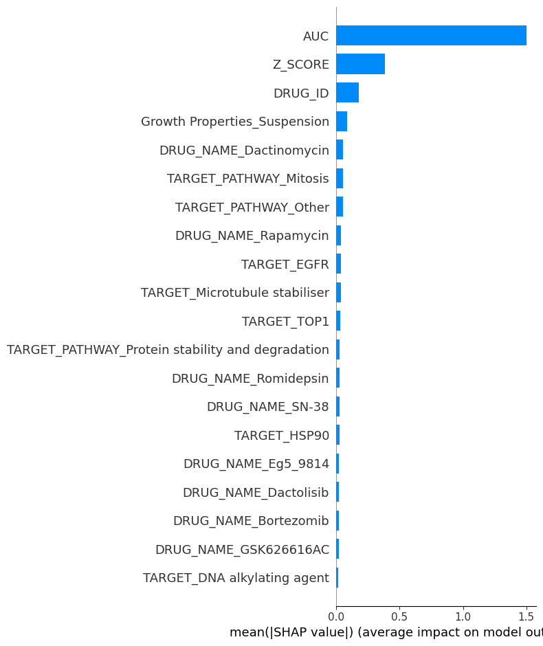
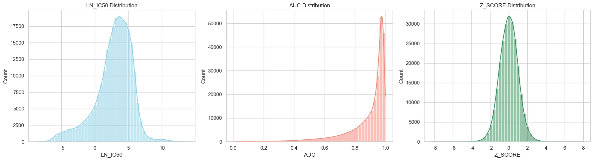
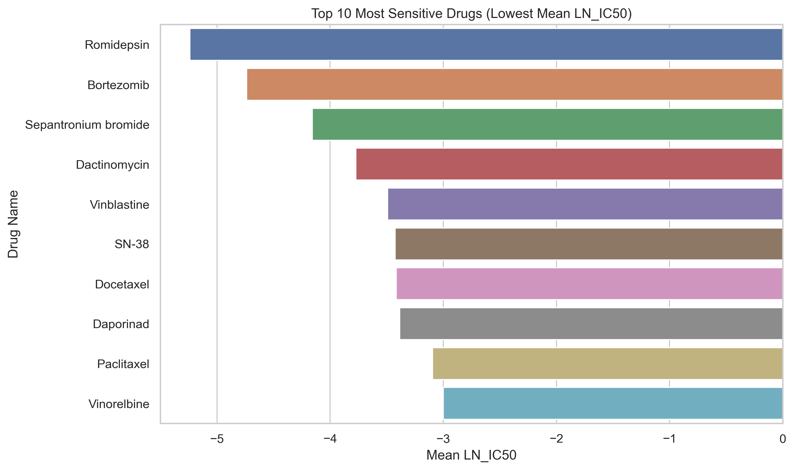

# Cancer Drug Sensitivity Prediction with XGBoost and SHAP (GDSC)

**A tuned XGBoost model predicted drug sensitivity (LN_IC50) for 242,035 drug and cell line pairs with R² 0.994 and RMSE 0.203. That score is inflated by target leakage, explained below.**

Python · pandas · scikit-learn · XGBoost · SHAP · Seaborn · Matplotlib | October 2025 | Project lead

> **Leakage caveat.** AUC and Z_SCORE were used as input features, but both are calculated from the same dose-response curve as the target LN_IC50. They were also the two most important features in the SHAP analysis. So the R² of 0.994 does not show how well the model would predict sensitivity for a new drug and cell line pair. Re-running the model without AUC and Z_SCORE is the next step, and I will update this README with that result.

## Problem

Knowing which drugs a cancer cell line responds to is a step toward precision oncology. I set out to predict the drug sensitivity of cancer cell lines (LN_IC50, the natural log of the half maximal inhibitory concentration; lower means more sensitive) from drug, pathway, tissue and genomic information, and to explain what drives the predictions.

## Dataset

- **Source:** Genomics of Drug Sensitivity in Cancer (GDSC), Kaggle version: https://www.kaggle.com/datasets/samiraalipour/genomics-of-drug-sensitivity-in-cancer-gdsc (original resource: https://www.cancerrxgene.org/)
- **Size:** 242,035 drug and cell line pairs, 19 columns
- **Features:** cell line and tissue descriptors, TCGA cancer type, microsatellite instability status, screen medium, growth properties, CNA, gene expression and methylation flags, drug name, drug target and target pathway, AUC and Z_SCORE
- **Target:** LN_IC50
- Download steps are in [data/README.md](data/README.md). The raw data is not committed.

## Method

1. Checked missing values. The largest gaps were Cancer Type (21.3% missing) and TARGET (11.2%). Filled annotation columns with "Unknown" and dropped rows with no TARGET_PATHWAY.
2. Explored the distributions of LN_IC50, AUC and Z_SCORE, the most common tissue types, the drugs with the lowest mean LN_IC50, LN_IC50 by tissue and by target pathway, and drug coverage per cell line.
3. One-hot encoded drug name, target pathway, cancer type and the other categorical columns, dropped the ID columns and capped LN_IC50 outliers with the IQR method.
4. Split 80/20 into train and test sets (`random_state=42`) and trained a baseline `XGBRegressor` (300 trees, depth 7, learning rate 0.05).
5. Tuned XGBoost with `RandomizedSearchCV` (20 combinations, 3 fold CV, scored on RMSE, GPU training).
6. Explained the model with SHAP summary (beeswarm) and bar plots.

## Results

| Model | R² | RMSE | MAE |
|---|---|---|---|
| XGBoost baseline | 0.9733 | 0.4337 | 0.3361 |
| XGBoost tuned | **0.9941** | **0.2034** | **0.1431** |

Best parameters: 700 trees, max depth 7, learning rate 0.1, subsample 0.7, colsample_bytree 0.7, gamma 0, reg_alpha 0.5, reg_lambda 1.5.

**Both rows include AUC and Z_SCORE as features, so both are affected by the leakage described above.**

SHAP shows AUC and Z_SCORE far ahead of every other feature, then drug identity (DRUG_ID and drug names such as Dactinomycin and Rapamycin), growth properties, and drug targets and pathways such as Mitosis and EGFR. The dominance of AUC and Z_SCORE is itself a sign of the leakage.

<p align="center">
  
</p>

<p align="center">
  
</p>

<p align="center">
  
</p>

More charts (tissue types, LN_IC50 by tissue and pathway, drugs per cell line, SHAP beeswarm) are in [figures/](figures/).

## Limitations

- **Target leakage** from AUC and Z_SCORE, as explained at the top. The realistic performance is unknown until the model is retrained without them.
- **Random row split.** The same cell lines and drugs appear in both train and test sets, so the test score measures filling gaps in a known matrix, not predicting new drugs or new cell lines. Grouped splits by cell line or by drug would be a harder and fairer test.
- **Code gaps.** The code in the notebook comes from my original write-up and still has gaps from an earlier draft (variable names that do not match, the IQR bounds and the SHAP explainer step are not shown). These are marked in the notebook.
- The genomic features here are summary flags (CNA, gene expression, methylation), not full molecular profiles.
- Cell line results are preclinical and need external validation (for example on CCLE) before any translational use.

## Next steps

1. Retrain without AUC and Z_SCORE and report the new R², RMSE and MAE.
2. Evaluate with grouped splits by cell line and by drug.
3. Add a sensitive vs resistant classification version with ROC-AUC and F1.

## How to run

```bash
git clone https://github.com/mukisakaweesi/gdsc-drug-sensitivity-xgboost-shap.git
cd gdsc-drug-sensitivity-xgboost-shap
python -m venv .venv
source .venv/bin/activate        # on Windows: .venv\Scripts\activate
pip install -r requirements.txt jupyter
# download the data and save it as genomic_data.csv in this folder (see data/README.md)
jupyter notebook gdsc_drug_sensitivity.ipynb
```

The tuning cell uses `tree_method='gpu_hist'`, which needs an NVIDIA GPU. On a CPU, change it to `tree_method='hist'` and remove `predictor='gpu_predictor'`.

## Repository contents

```
gdsc_drug_sensitivity.ipynb   EDA, model, tuning and SHAP
figures/                      charts from the analysis
data/README.md                where to get the data
requirements.txt
LICENSE
```

## Contact

Kaweesi Abdulrahim Mukisa, healthcare data scientist in Kampala, Uganda

- Email: mukisakaweesi@gmail.com
- LinkedIn: https://www.linkedin.com/in/kaweesi-abdulrahim-mukisa-919326252/
- Portfolio: https://app.notion.com/p/1fcc3e1ef98f80e4bd57c2148954d746
